## 软件工程综合实验3B组项目验收报告

# 
#———————————————————————————
# 
## 测试计划与结果
# 
# 
#  
#  
#  
###  —————————目录——————————
####  一．APP端
*  1.计划
* 2.过程与结果
	* 2.1  分析与检测app的兼容性
	* 2.2  分析与检测app的功能是否达到要求
	*  2.3  分析与检测app的安全性
* 1.4描述定义
#### 二. 服务端
* 1. 性能测试
	* 1.1  精灵云测
	* 1.2  听云
	* 1.3  阿里云压测
	* 1.4  单元测试

###  ——————————————————————
# 
###  一、APP端
APP分为android和ios两个版本，由于打包为ios版本时，证书的Provisioning Profiles为ad hoc版，不是发布版，所以不能使用现成的测试服务机构进行兼容性测试。
但是考虑到本app采用ionic进行跨平台开发，两个平台共用同一份javascript逻辑代码。所有涉及到调用原生系统服务最终都是调用由ionic或者cordova提供的第三方库，所以在认为第三方库足够可靠的情况下，既然代码是共用的，只需要对其中一个平台进行测试就可以了。
#### 1.计划
对于APP的测试分为三步：
* 第一步是检测该app的兼容性，借助第三方测试机构，检测该app是否能在设备上正常安装，正常开启，使用有效的帐号与密码正常登录，正常卸载等一整个app的生命流程；
*  第二步是检测该app的功能是否达到要求，是否满足事先设计好的功能需求，这种测试也可以分为两部分。一部分是在不考虑服务器的情况下，对于在使用过程中发送的HTTP的GET请求，返回本地的静态数据，这样的话每次获取的数据都是可以确定的，避免因为获取的数据格式问题或者网络连接问题造成的app显示问题，另一方面，本APP使用了缓存技术，将一些GET请求缓存在本地，可以减少服务器的并发压力；另一部分是在将app与服务器对接上以后，事先设计好一些UI操作，判断操作的结果是否符合预期的设计。
*  第三步是借助第三方测试机构对app的安全性进行测试，包括配置安全、代码安全、数据传输等几个方面，检测是否会在使用过程中泄漏敏感信息，关键信息是否加密传输，是否对用户的输入内容格式进行检测等内容。
#### 2.过程与结果
##### 2.1  分析与检测app的兼容性，由于在检测兼容性的过程中需要在大量真机上进行安装测试，个人无法满足这个条件，因此考虑使用第三方的测试机构提供的服务，由于个人开发的限制，所以使用的都是可以免费使用的第三方app兼容性测试服务：百度移动云测试以及Testin测试服务。
* 百度移动深度兼容云测试，测试了106款android设备的兼容性，97台设备测试通过，6台设备闪退，3台设备卡死，出具的详细报告如下：
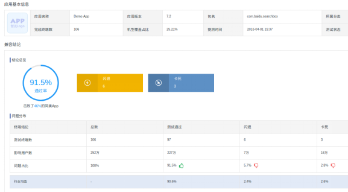
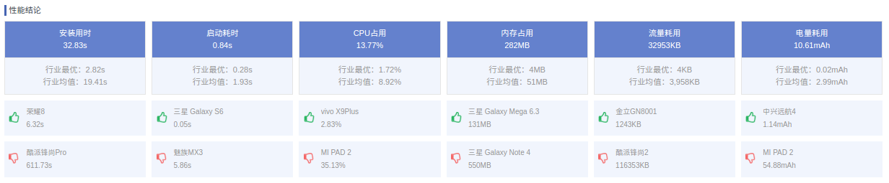
* Testin标准兼容测试，测试了50款android设备的兼容性，通过率为49/50，出具的详细报告如下：
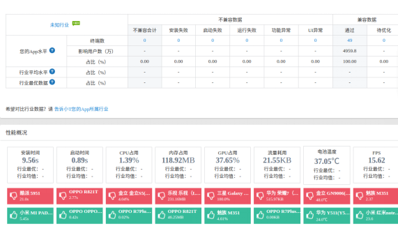
##### 2.2  分析与检测app的功能是否达到要求，这一步主要是通过手动测试的方式，预先设计好一系列连续的相关操作，并对这些操作的结果进行预测，特别是任务模块，某个任务会涉及大量的成员，而在任务的不同阶段进行不同的操作又会导致不同的结果，下一步所涉及到的人员也会不同，逻辑十分复杂，所以采用手动测试的方法进行测试。
##### 2.3  分析与检测app的安全性。开发的过程中主要有三个方面和安全性有关:
* 第一点是所有的数据传输都使用https协议，https会自动对Request的head和body进行加密，所以在API的设计时，将关键信息都放置于body中，另一方面，所有的密码都经过md5加密后传输，并且数据库里只存有加密后的代码，不存储明文密码。
* 第二点是本app的功能之一是显示markdown格式的通知，所以要将符合markdown语法的文本渲染成DOM后嵌入到app的页面中，然而在DOM中就有可能会嵌有危险的可执行代码，所以使用angular的$sanitize服务和$sce服务根据一个白名单来净化html标签，这样得到的DOM中就不会有不安全的内容了。
* 第三点是对用户的所有输入进行验证，防止数据库注入攻击，但一方面我们的数据库采用mongodb非关系型数据库，并使用了ORM技术，防止了数据库的注入攻击。
不仅如此，我们还使用了第三方机构提供的服务来检测了app的安全性，同样使用了Testin提供的安全测试服务，生成的报告如下：
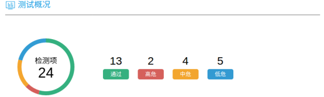
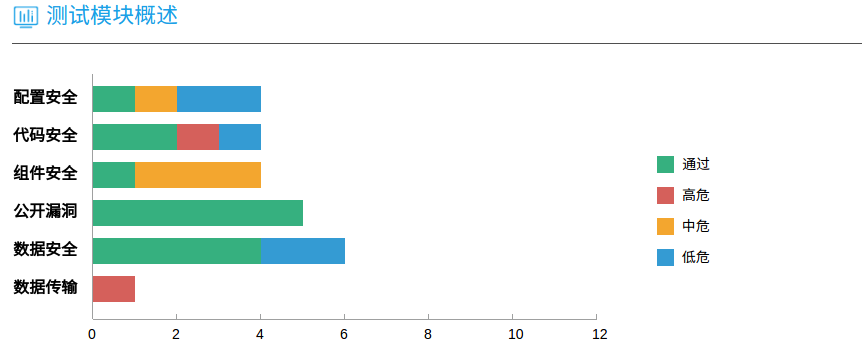
其中两个高危漏洞分别为反编译和中间人劫持，具体报告如下：
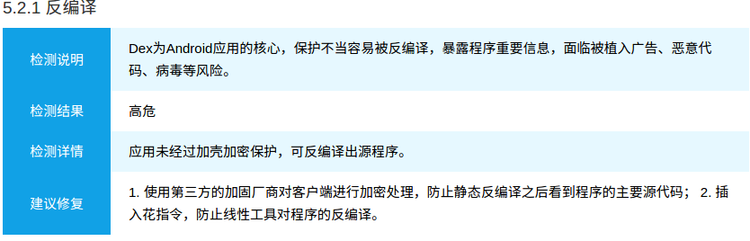
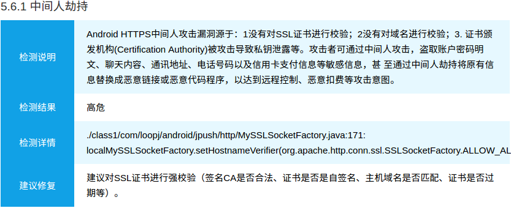
由于本app采用ionic框架，使用javascript进行开发，对于关键的业务逻辑代码并不能进行编译，只能使用uglifyjs对代码进行混淆，并使用webpack将所有代码文件打包合并，增加了攻击者反编译之后理解代码的难度。
### 二. 服务端
服务端测试在本项目中主要分为三大类：单元测试、持续集成发布测试以及接口性能测试。由于本项目服务端基于java的spring框架，所以单元测试基于spring-test和junit，持续集成发布测试基于Daocloud服务，性能测试则使用了阿里云压测、精灵云测以及听云等多个第三方测试平台，综合得出测试结果并分析。
####1.  性能测试
##### 1.1  精灵云测
我们使用此测试服务对数据量最大的接口之一company/0（获取id为0的公司基本信息及所有部门信息）进行了测试
[结果动态展示](http://180.169.149.5:48089/cpt/index.html#/freetest/result?freetestId=cloud_load_6118571198216603357)
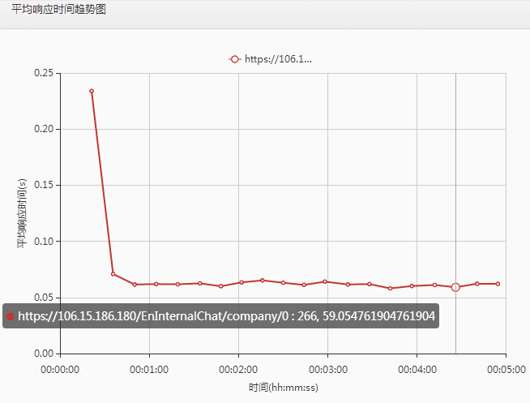
从响应结果上看，初次访问响应速度在250毫秒左右，速度尚可，稳定下来后固定在50-100毫秒，服务器的响应速度良好，基本不存在明显的延迟。
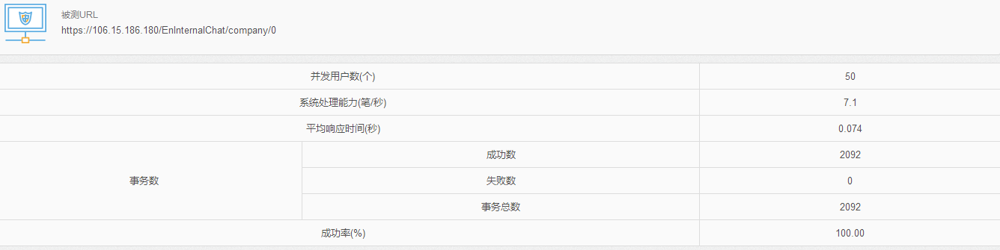
设置并发用户数为50的时候访问效果完美，不存在访问响应失败问题，可见服务器完全负担得起50以上的并发用户数。
##### 1.2  听云
我们使用听云的免费测评服务对数据量最大的接口之一employee/0进行了测评，出具综合测评结果如下：
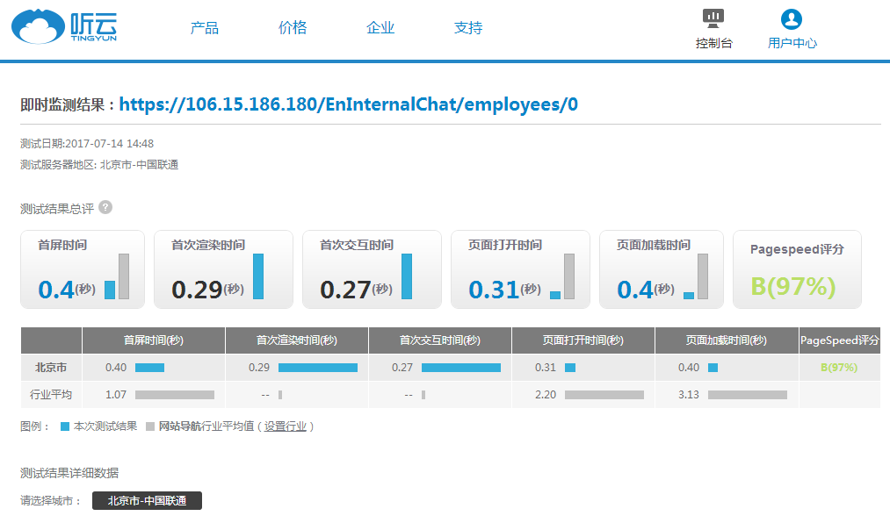
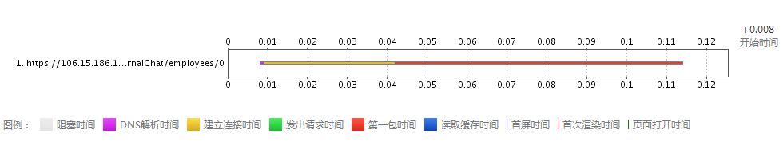
##### 1.3  阿里云压测
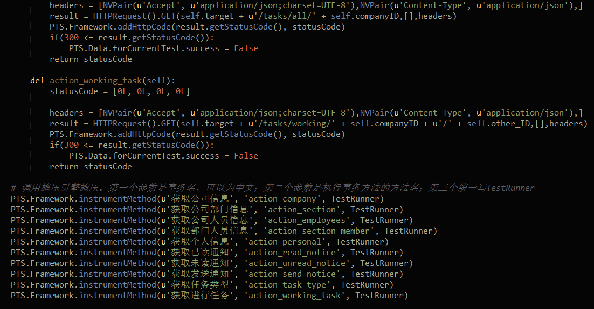
测试脚本详情见test_api.py
##### 1.4  单元测试
单元测试部分集成Junit+spring-test，位于源代码的test目录下，对每个不涉及文件操作传输的controller的接口方法都进行了测试，对http基本的get方法测试如下（注：由于主数据库使用的mongodb以及session共享使用的redis均为非关系型数据库，并不支持关系型数据库的回滚操作，也不支持事务定义，因此无法对post和delete请求进行单元测试，因此此处只对get请求进行测试）：
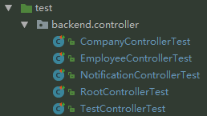
接口测试通过率100%：
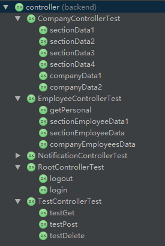
