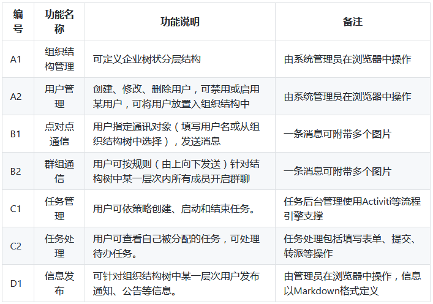
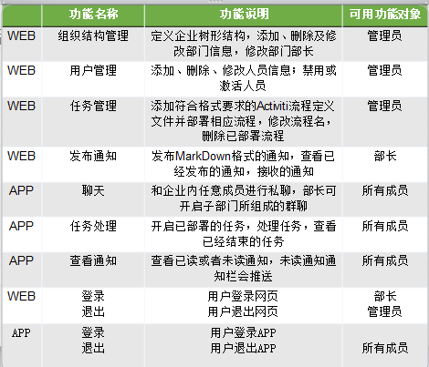

##软件工程综合实验3B组项目验收报告

# 
#———————————————————————————
# 
##需求说明
# 
# 
# 
### —————————目录——————————
####1．引言
* 1.1文档信息
* 1.2项目背景
* 1.3编写目的
* 1.4描述定义
####2．引言任务概述
* 2.1项目目标
* 2.2用户描述
* 2.3假定和约束
####3 . 需求规定
* 3.1功能需求
* 3.2性能需求
* 3.3技术需求
####4 . 功能设计
* 4.1实现功能
* 4.2功能介绍
	* 4.2.1登陆退出功能
	* 4.2.2 web端任务管理功能
	* 4.2.3 web端通知管理功能
	* 4.2.4 web端部门管理功能
	* 4.2.5 web端用户管理功能
	* 4.2.6 web端个人设置功能
	* 4.2.7 APP聊天管理功能
	* 4.2.8 APP通知管理功能
	* 4.2.9 APP任务管理功能
	* 4.2.10 APP账户管理功能
####5 . 非功能性需求
* 5.1界面特性
* 5.2时间特性
* 5.3灵活性
* 5.4安全保密性
####6 . 开发环境
* 6.1开发语言
* 6.2开发数据库
* 6.3 操作系统
####7 . 未来需求
####8 . 总结
### ——————————————————————
# 
# 
#### 1 . 引言
##### 1.1文档信息：

| 标题       | 企业内部沟通交流APP需求说明书   |  
| --------   | -----:  | 
| 创建日期	     | 2017.07.12 |   
| 所有者	       |  软工实验3B组   | 
|解释权	        |   软工实验3B组    |  
|修订记录	        |   2017.07.12    | 
##### 1.2项目背景
项目来源：南京大学计算机科学与技术系2014级大三软件工程大实验，由曹春老师带领并指导小组成员完成实验项目。
项目开发者：小组成员，本组编号为3B，小组成员为焦点、廖祥森、陈潢。
##### 1.3编写目的
文档对产品整体的功能和涉及操作进行了详细完整的说明，以便使用者能迅速明确本产品的使用方式，体验本产品功能的操作简单容易便捷，提高使用者对产品的使用感受。
##### 1.4描述定义

| 术语/定义       | 说    明  |  
| --------   | -----:  | 
| 开发方	     | 2017-3B组成员|   
|   用  户     |企业公司员工，分类包括“管理员”、“部长”、“部员”| 
#### 2 . 任务概述
#####2.1项目目标
本产品基于前言描述，希望构建专用于企业内部沟通交流的软件。关于软件分别有网页版和移动设备版（iOS版及安卓版），使用范围广泛。
#####2.2用户描述
为了更好的开发产品，针对企业内部将用户分为管理员、部长、部员三个等级，从而使权限以及用户功能简单分明。
#####2.3假定和约束
本文档经双方确认后，开发方依据本文档进行下阶段工作。若中途需求发生变更，则双方重新沟通，具体解决方案另行协商。

####3.需求规定
#####3.1功能需求
企业内部沟通app主要功能包括：
* .组织构架：企业可以根据自己企业的内部构架设置部门和岗位，员工可以轻松了解公司的内部构造，并基于组织架构进行沟通交流。
* .在线交流：企业内部员工之间可以通过该软件进行文字和图片交流，支持点对点、广播及组播等多种交流方式。
* .任务管理：通过任务管理，可以让团队成员轻松了解谁该怎什么时间内完成什么任务，并通过App进行任务处理（审核批示、信息填报等）。
* .信息发布：企业可面向特定范围的员工发布公告通知等信息。
具体功能需求如下：

#####3.2性能需求
* .软件并发用户数须大于50人，响应时间小于1秒，应用延迟时间小于2秒（需提供第三方测试报告）。
* .软件功能设计合理，易于操作使用，用户可快速掌握软件操作。
#####3.3技术需求
* .软件采用C/S和B/S架构，移动应用支持Android和iOS平台，Web端支持主流浏览器；全栈开发相关技术请参考示例。
* .移动端UI设计需采用现有模板（如themeforest所提供的模板），Web UI设计采用Bootstrap框架，且两者基于同一套后台API（建议设计为Restful API）访问后台服务（数据）；
* .后台部署需支持linux操作系统；基于非关系型数据库进行数据存储；支持通过二次开发动态增加功能模块；
#### 4.功能设计
#####4.1实现功能

#####4.2功能介绍
#####4.2.1登陆退出功能
Web网页的使用者是部长和管理员级别，因此只有管理员和部长级用户才可能登录成功。
APP端的使用者是公司所有员工，因此所有员工都有可能登录成功。
Web端和APP端都需要用户登录成功才可以进入首页。
登录成功后都需要用户点击退出才能退出登录账号。
#####4.2.2 web端任务管理功能
仅属于管理员的功能。
管理员可在此功能界面对任务流程进行一系列操作。通过增删改在web网页端更改任务流程。
针对某个任务，可进行对任务名进行更改，对任务流程进行查看。
针对新建任务功能，可定义新任务名及上传其对应的流程XML图。
#####4.2.3 web端通知管理功能
管理员和部长可在此功能页面处查看通知列表，以及查看通知的分类情况，比如已读、未读及个人发送的通知。
管理员和部长可在此功能界面点击某条通知，查看通知具体内容。
查看某条未读通知后，通知列表更新，该通知归为历史通知。
仅部长可在此功能页面进行新建通知。新建通知功能处，通知的接收方可选择该部长管理的多个部门中的一个或多个部门，通知具体内容编辑格式为markdown格式。
#####4.2.4 web端部门管理功能
仅属于管理员的功能。
管理员可在此功能界面对公司部门的树状结构进行一系列操作。通过增删改在web网页端更改公司部门的结构，形成新的公司结构树。
针对公司某个部门，可对部门名称、部门部长人选、部门描述等进行查看修改操作。
#####4.2.5 web端用户管理功能
仅属于管理员的功能。
管理员可在此功能界面对用户信息进行一系列操作。通过增删改在web网页端更改用户信息。
针对公司某部门的某个用户，可以进对其所属部门、联系方式、状态为禁用或激活等进行查看修改操作。
#####4.2.6 web端个人设置功能
部长及管理员可在此功能界面对个人信息进行一系列查看或更改操作，具体的个人信息分为邮箱、备用邮箱、联系方式、备用联系方式、密码等。
更改个人信息时，输入必须符合格式，具体分为邮箱格式、联系方式格式、新密码及确认密码输入相同。
#####4.2.7 APP端聊天管理功能
所有用户课在此功能界面可选择通讯对象（填写一个用户名进行私聊，或从部门结构树中选择多个部门进行群聊），发送消息。另外，除了文字，一条消息可附带多个图片
#####4.2.8 APP端通知管理功能
所有成员可在此功能界面处查看通知列表，即通知分类：未读通知、历史通知；
可在此功能界面点击某条通知，查看通知具体内容。
查看某条未读通知后，通知列表更新，该通知归为历史通知。
#####4.2.9 APP端任务管理功能
所有成员可在此功能界面处查看任务列表，即任务分类：待处理任务、历史任务；
可在此功能界面点击某条任务，查看任务具体内容，以及进行任务处理。
成员对任务处理完成后任务列表更新，待处理任务已为历史任务。
#####4.2.10 APP端账户设置功能
所有成员可在此功能界面处进行查看或更改个人信息操作，具体的个人信息分为头像、系统语言、联系方式、密码等。
更改个人信息如联系方式及密码时，输入必须符合格式，具体分为邮箱格式、联系方式格式、旧密码输入正确、新密码与确认密码输入相同。

####5.非功能性需求
#####5.1界面特性
本软件界面具有一致性、连续性，各种提示简单而清晰，色彩协调、文字简洁、画面均衡、布局合理且美观，容易上手、可操作性强。
#####5.2时间特性
实现了软件并发用户数须大于50人、响应时间小于1秒及应用延迟时间小于2秒的规定。
#####5.3灵活性
本软件对于一些变化的适应能力很强，灵活性很高，比如对操作系统的适配性能很高。
#####5.4安全保密性
用户只能通过有效的身份验证进入软件。
####6.开发环境
#####6.1开发语言
前端开发语言使用HTML、JavaScript、CSS等语言
后端开发语言使用Java语言
#####6.2开发数据库
MySQL：关系型数据库管理系统
MogoDB：基础数据的非关系型数据库，文档型。
Redis：Session数据库，可扩展性强（负载均衡，共享session等）
#####6.3 操作系统
软件支持Windows、Android及iOS。

####7.未来需求
软件版本更新，功能模块可拓展。

####8.总结
通过小组成员对客户各方面需求的分析，编写此需求分析书，为软件产品的开发做基础。